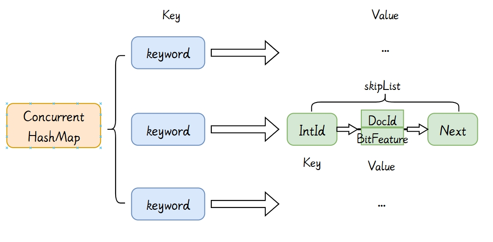
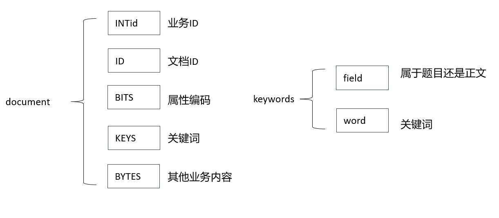
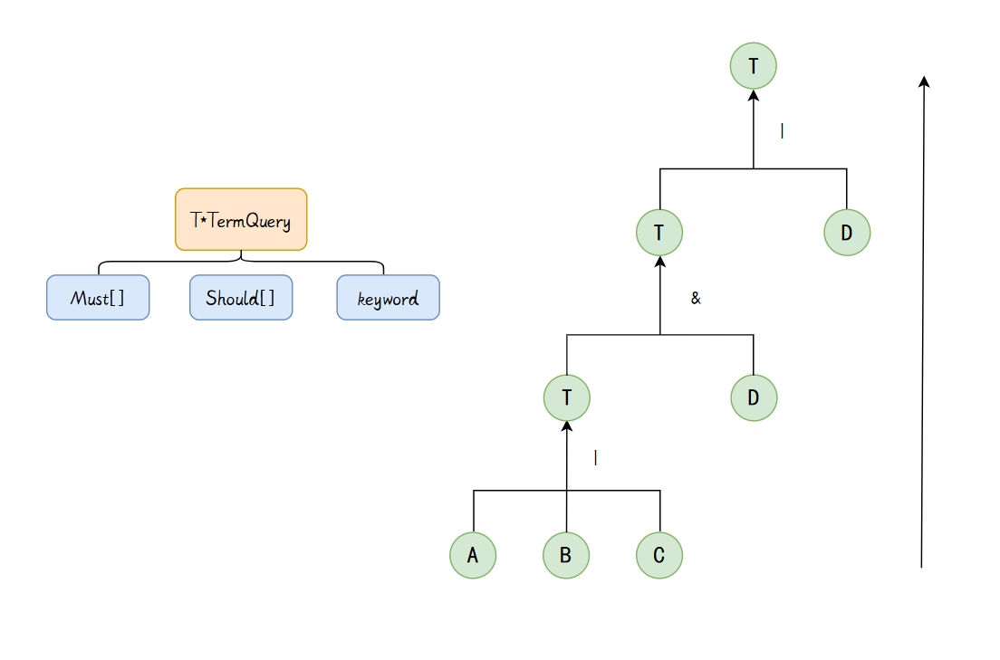

# 分布式搜索引擎设计

##  逻辑结构



## 文件结构

```shell
| go.mod
| go.sum
|
|--internal
|       |--kv_db
|       |       |
|       |       |--kv_db.go
|       |       |--bolt_db.go
|       |       |--badger_db.go
|       |
|       |--reverse_index
|               |
|               |--reverse_index.go
|               |--skiplist_reverse_index.go      
|--types
|      |--doc.proto
|      |--doc.pb.go
|      |--doc.go
|      |--term_query_v0.go
|      |--term_query.go
|
|--utils  
|      |--invert_index_01.go
|      |--concurrent_hash_map.go
|      |--bits.go
|    
|
```
### kv_db

定义bolt和badger两种kv数据库连接类型

#### kv_db.go

统一用到的方法封装成接口并创建连接

```go
type IKeyValueDB interface {
	Open() error
	GetDbPath() string
	Set(k, v []byte) error
	BatchSet(keys, values [][]byte) error //批量写入k和v
	Get(k []byte) ([]byte, error)
	BatchGet(keys [][]byte) ([][]byte, error)
	Delete(k []byte) error
	BatchDelete(keys [][]byte) error
	Has(key []byte) bool                     //判断是否有key
	IterDB(fn func(k, v []byte) error) int64 //遍历数据库，返回数据条数
	IterKey(fn func(k []byte) error) int64   //遍历所有key，返回数据条数
	Close() error                            //关闭数据库
}

func GetKvDb(dbtype int, path string) (IKeyValueDB, error) {
	...

	var db IKeyValueDB
	switch dbtype {
	case BADGER:
		db = new(Badger).WithDataPath(path)
	default:
		db = new(Bolt).WithDataPath(path).WithBucket("radic")
	}

	err = db.Open()

	return db, err
}
```

####  其他两个是两张数据库中接口方法的具体实现

### reverse_index

根据跳表实现的初步倒排索引

#### 1.reverse_index.go

用接口定义了实现倒排索引必须的功能

```go
type IReverseIndexr interface {
	Add(doc types.Document)                        //添加文章
	Delete(IntId uint64, keyWord []*types.Keyword) //删除文章
	Search()                                       //搜索文章
}
```

#### 2.skiplist_reverse_index.go

跳表的求交集和并集，增加删除操作。


```go
...
func (indexer *SkipListReserveIndex) Add(doc *types.Document) {
	//遍历文章中的所有关键词
	for _, Keyword := range doc.Keywords {
		key := Keyword.Tostring()
		lock := indexer.getLock(key)
		lock.Lock()
		defer lock.Unlock()
		skipListValue := &SkipListValue{doc.Id, doc.BitsFeature}
		if value, exists := indexer.table.Get(key); exists {
			list := value.(*skiplist.SkipList)
			list.Set(doc.Id, skipListValue)
		} else {
			list := skiplist.New(skiplist.Uint64)
			list.Set(doc.Id, skipListValue)
		}
	}
}
...
```


### types

文档和关键词结构体的定义



#### 1.doc.proto

proto文件，定义两种结构体

#### 2.doc.pb.go

由proto文件转成go文件

#### 3.doc.go

定义一种方法将关键字的field类型和word拼接

#### 4.term_query_v0.go

初始化的搜索逻辑

### utils

存储项目所需要的公共用具

#### 1.invert.index_01.go

初步构建倒排索引算法，根据文档关键字获取文档ID

```go
func BuildInvertIndex(docs []*Doc) map[string][]int {
	result := make(map[string][]int, 100)
	for _, doc := range docs {
		for _, key := range doc.Keys {
			result[key] = append(result[key], doc.Id)
		}
	}
	return result
}
```

#### 2.concurrent_hash_map.go

自建并发安全的hashmap，可读写，并绑定next方法用于遍历

```go
type ConcurrentHashMap struct {
	Mps   []map[string]any
	Locks []sync.RWMutex
	Seg   int
	Seed  uint32
}


...
func (iter *ConcurrentHashMapIterator) Next() *MapEntry {
	if iter.RowIndex >= len(iter.Keys) {
		return nil
	}

	row := iter.Keys[iter.RowIndex]
	if len(row) == 0 {
		iter.RowIndex++
		return iter.Next()
	}
	key := row[iter.ColIndex]
	value, _ := iter.Cmp.Get(key)
	if iter.ColIndex >= len(row)-1 {
		iter.ColIndex = 0
		iter.RowIndex++
	} else {
		iter.ColIndex++
	}
	return &MapEntry{Key: key, Value: value}
}

```

#### 3.bits.go

位运算相关算法

```go
...
func IsBit1(n uint64, i int) bool {
	if i > 64 {
		panic(i)
	}
	c := uint64(1 << (i - 1))
	if n&c == c {
		return true
	} else {
		return false
	}
}

func SetBit1(n uint64, i int) uint64 {
	if i > 64 {
		panic(i)
	}
	c := uint64(1 << (i - 1))
	return n | c
}

func CountBit1(n uint64) int {
	c := uint64(1)
	sum := 0
	for i := 0; i < 64; i++ {
		if c&n == c {
			sum++
		}
		c = c << 1
	}
	return sum
}
...
```

#### 4.skip_list.go

跳表相关。多跳表求交集并集。

```go
func UnionsetOfSkipList(lists ...*skiplist.SkipList) *skiplist.SkipList {
	if len(lists) == 0 {
		return nil
	}
	if len(lists) == 1 {
		return lists[0]
	}
	result := skiplist.New(skiplist.Uint64)
	keySet := make(map[any]struct{}, 1000)
	for _, list := range lists {
		if list == nil {
			continue
		}
		node := list.Front()
		for node != nil {
			if _, exists := keySet[node.Key()]; !exists {
				result.Set(node.Key(), node.Value)
				keySet[node.Key()] = struct{}{}
			}
			node = node.Next()
		}
	}
	return result
}
...//求交集的省略
```

